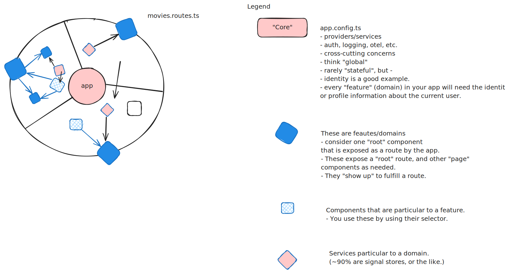

# Day 1 Review

- Signals should be the primary way of accessing data at the "edges" of your application.
- See the diagram 

## Dependencies

You need "boundaries". It's healthy. My therapist tells me that all the time.

- Component Boundaries
  - Local state (using Signals, and in some rare cases, observables)
  - Receive data from:
    - inputs
      - good for UI components, not "business" components so much.
    - injected services
      - share state / behavior across components not in a parent/child relationship.
- Feature (or domain) boundaries
  - Can use services provided by the app. (`app.config.ts` `providers:[]`)
  - Can use components that are designated as "commmon" (or shared, or whatever).
  - **Do Not** use another features:
    - State\*
    - Components
    - Uhm, nothing.
- Some features aren't that discrete.
  - Do you share data with just your feature or across the entire application (e.g. move it to common)?
  - It's a challenge and why "global state" (e.g. Redux) is so tempting.
  - We'll look at some better ways to do that today.

## The Biggest Problem Dependencies

- `node_modules`
- These are shared by _everything_ in your app, and cause a bunch of problems, as you probably know.
- You _have_ to keep these updated.
  - This is the _right_ argument against `--legacy-peer-deps` use.
  - They can become an obstacle - causing us to delay being responsive to the business.
    - Breaking changes? We inherit them.
  - My suggestion:
    - Minimize using them as much as possible.
    - Be deliberate about taking dependencies.
    - For example, teams I work with:
      - Do hippy-dippy "trunk based" development.
      - No branches, everyone can push to "main" any time.
      - _except_ changes to `package.json`. Those have to be in a PR by itself (nothing else) and needs approved by the _entire_ team.

### Alternatives

- Write it yourself. See [pad-left](https://en.wikipedia.org/wiki/Npm_left-pad_incident)
- For cross-cutting dependencies in your app there is not really a good way to say "this part of my application can use this dependency, this part can't".
- Consider isolating those in your own packages.
  - Levels:
    - Use "common" pattern like I have in this project along with a tool like Sheriff.
      - This is "early bound" - so changes show up in the build right away if there are problems.
    - Create actual library packages _embedded in your project_.
      - This isn't a great option unless you are using a good monorepo tool (turbo, nx, etc.)
      - Talk to Jamie about npm workspaces.
      - Angular isn't great at this "out of the box"
    - Create actual packages.
      - Publish them (internally, artifactory, etc.) or on NPM.
        - This is "late bound" so not all that great for many things.
        - Can cause a lot of headaches and requires a lot of responsibility (see CoreUi).
